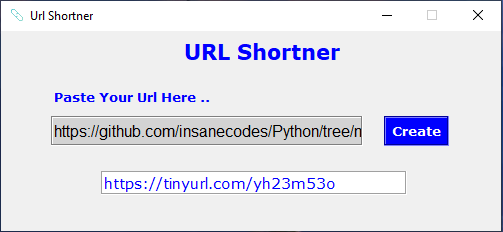

# URL Shortener by Nitin Singh

A URL Shortener GUI Made Using Python 
It reduces the length of the URL so that it can be shared easily on platforms like Twitter, where number of characters is an issue. 
Hope You Will Like It.

## Demo

## Table of Contents
1. [Introduction](#introduction)
2. [Features](#features)
3. [Technologies Used](#technologies-used)
4. [Installation](#installation)
5. [Usage](#usage)
6. [Contributing](#contributing)

## Introduction

The URL Shortener is a simple yet powerful tool built with Python that can be used to generate short URLs for long links. It is particularly useful for sharing links on social media or platforms with character limits. The application takes a long URL as input and generates a unique short alias that redirects to the original URL when accessed.

## Features

- Create short aliases for long URLs.
- Redirect users to the original URL when they access the short alias.
- Maintain a database of short aliases and their corresponding original URLs.
- Support for custom short aliases (if available).
- Minimalist user interface for ease of use.

## Technologies Used

The URL Shortener project is built using the following technologies:

- Python: For the backend logic and URL shortening algorithm.
- Flask: As the web framework to handle HTTP requests and responses.
- SQLite: As the lightweight database for storing short aliases and their corresponding URLs.

## Installation

To set up the URL Shortener locally, follow these steps:

1. Clone this repository to your local machine using `git clone https://github.com/nitinsingh0219/url-shortner.git`.
2. Navigate to the project directory: `cd url-shortener`.
3. Install the required dependencies by running: `pip install -r requirements.txt`.

## Usage

To run the URL Shortener, execute the following command in the project directory:
This will start the Flask development server, and you can access the application by visiting `http://localhost:5000` in your web browser.

Usage instructions:

1. **Shorten URL**: On the home page, enter the long URL you want to shorten and click the "Shorten" button. The application will generate a short alias for the URL.
2. **Access Shortened URL**: To access the original URL from the short alias, simply enter the short alias in the browser address bar. The application will redirect you to the original URL.

Please note that the short aliases generated are unique and do not expire. Custom short aliases may be supported based on availability.

## Contributing

We welcome contributions to improve and enhance the URL Shortener project. If you'd like to contribute, please follow these steps:

1. Fork the repository on GitHub.
2. Create a new branch with a descriptive name: `git checkout -b feature/my-awesome-feature`.
3. Make your changes and commit
